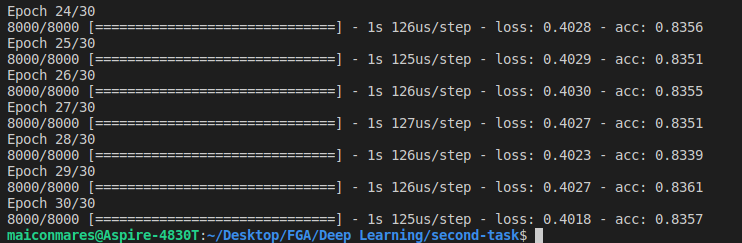
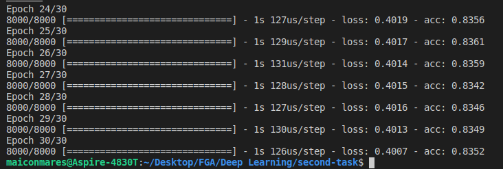
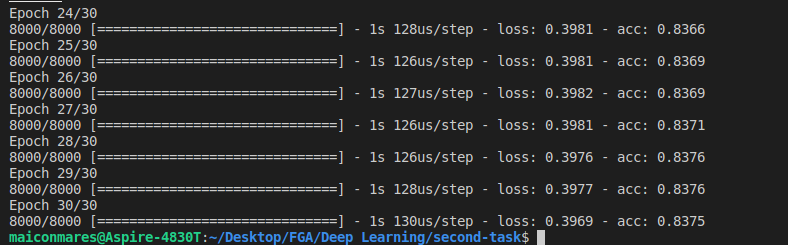
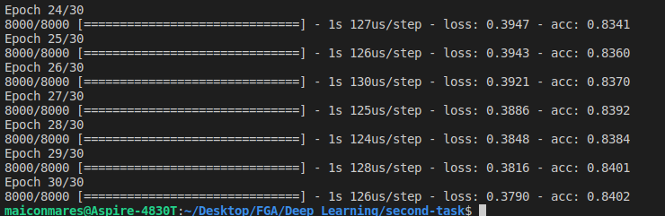
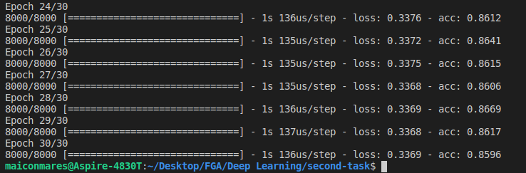

# Construindo uma Rede Neural Artificial

Construindo sua primeira rede neural usando Keras, Theano e Tensorflow
Parte da matéria de DeepLearning da escola de Engenharia de Software da UnB

## Usage

### jupyter-notebook

Open a `jupyter-notebook` in your desired `env` and run the command:

```sh
jupyter-notebook ArtificialNeuralNetwork.ipynb
```
### Python module

Install the requirements in the desired `env`:

```sh
pip install -r requirements.txt
```

Run the python module and make changes in a file editor:

```sh
python ann.py
```

or

```sh
python evaluating_improving_tuning.py
```

## About 
<p style="text-indent:20px">On this project was tested 3 activation functions, they include: ReLU, LeakyReLU and PReLU. They were used in the hidden and input layers. The resulting accuracy was compared when changing each function to another.
</p>

### Results
<ol>
    <li>
        <h4>ReLU:</h4>
        
    </li>
    <li>
        <h4>Leaky ReLU Standard:</h4>
        
    </li>
    <li>
        <h4>Leaky ReLU (alpha=0.1):</h4>
        
    </li>
    <li>
        <h4>Leaky ReLU (alpha=0.01):</h4>
        
    </li>
    <li>
        <h4>PReLU:</h4>
        
    </li>
</ol>

<p style="text-indent:20px">According to the results above, for input and hidden layers, the PReLU function has presented the best results. For a good comprehension of this ANN, in the Output layer, was choosen a Sigmoid function, because it fits well to handle with output values bound between 0 and 1.</p>

<h3 style="text-weight:bold">References</h3>
<p>Missing Link AI.7 Types of Neural Network Activation Functions: How to Choose?. Retrieved from <a href="https://missinglink.ai/guides/neural-network-concepts/7-types-neural-network-activation-functions-right/">https://missinglink.ai/guides/neural-network-concepts/7-types-neural-network-activation-functions-right/</a> </p>
