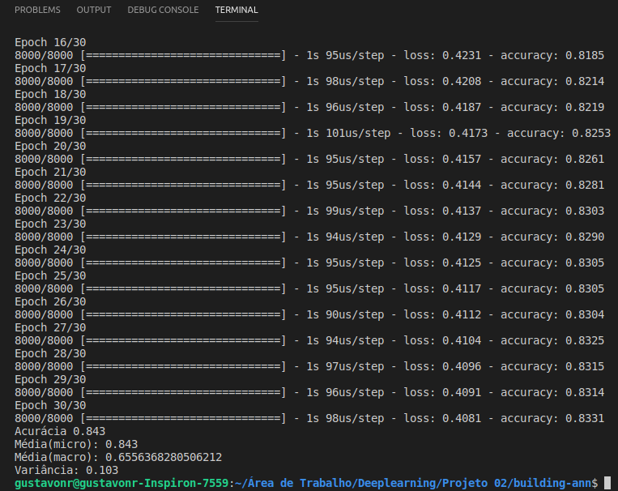

# Construindo uma Rede Neural Artificial

Construindo sua primeira rede neural usando Keras, Theano e Tensorflow
Parte da matéria de DeepLearning da escola de Engenharia de Software da UnB

## Funções de ativação

### ReLu
ReLU é a função de ativação mais amplamente utilizada ao projetar redes neurais atualmente. Primeiramente, a função ReLU é não linear, o que significa que podemos facilmente copiar os erros para trás e ter várias camadas de neurônios ativados pela função ReLU.

### Tanh
Tanh funciona de forma semelhante à função sigmóide, mas sim simétrico em relação à origem. varia de -1 a 1.

### Sigmoid
A função de ativação sigmoid é comumente utilizada por redes neurais com propagação positiva (Feedforward) que precisam ter como saída apenas números positivos, em redes neurais multicamadas e em outras redes com sinais contínuos.

## Resultado

